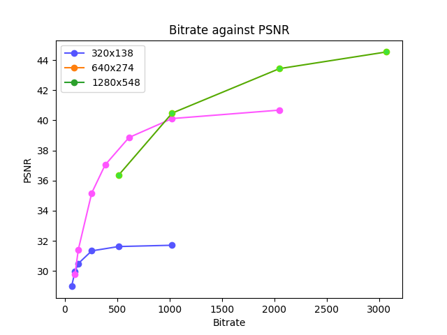

# Video Compression Bitrate Comparison using FFMPEG

This project investigate the trade-off between different strategies of transcoding DASH (H.264) representations for streaming.
To do this the same short video file is encoded at several different bitrates and various resolutions and the quality is compared quantitatively (using PSNR) and qualitatively.

To create each of the videos at different resolutions and bit-rates I created a python script, which performed a series of operations on each of the source video files. 

The following resolutions and bitrates were used to asses the video quality.

| Size    | Suggested Bitrates for RD Curves (Kbps) |
| :--------:           | :-------:                  |
| 720p : 1280 x 548  | 512 1024 2048                |
| 360p : 640 x 274   | 96 128 256 284 512 1024 2048 | 
| 180p : 320 x 128   | 64 96 128 256 512 1024       | 

The algorithm first converts the raw YUV file to an MP4 file using lossly
encoding, at a given constant bit-rate. It uses the H.264 video compression standard and
uses ffmpeg’s ”slow” preset. The MP4 file is then converted back to a YUV file using
lossless encoding. The third step in the algorithm is to upscale the resolution to 720p.
This is done so that each of the files can be evenly compared with the original 720p
video file. The compressed, encoded, up-scaled file is then compared with the original file
using the python FFMPEG Quality Metrics package. The package calculates the average
SSIM and PSNR of each video and appends it to an array so it can be displayed in a
graph later. PSNR is calculated by computing the Mean Square Error (MSE) between the
original frames and the compressed frames. The MSE is the sum of the squared differences
between each pixel in the two frames, divided by the total number of pixels. The MSE is
then used in the PSNR formula (1) with the Max value which is typically 255 for a 8-bit
video.
### Block Diagram of the Pocess which Calculates and Plots each Bitrate and Resolution 

</img>

The R/D plot in Figure 5, shows the RD curves for each of the representations. The points
highlighted in red are the estimations for the crossover bitrates i.e. the maximum bit-rate
where the quality of representations at 138p and 274p are greater than 274p and 548p
respectively.
 

</img>

***

## Optimal Resolutions
1. At 180p I would chose to represent the video with bit-rate of 96Kbs and which would result in a PSNR value of 28.5dB. Despite the 360p file having a higher PSNR value at the same bit-rate, the artifacts in the 360p file are too blocky and distracting at that bit-rate, see image below. I also qualitatively compared the videos at 256Kbps and at that stage 360p is definitely clearer. 96 Kbs probably wouldn’t be the result if you used a convex hull approach to find the best bit-rate, however I think a lower bit-rate of 64Kbps, would just be unwatchable in terms of quality.

2. For the 360p representation I would choose the 612Kbps bit-rate which would result in a PSNR of 39dB. I decided on this bit-rate for several reasons. First the quality appears comparable to the 720p version at the PSNR crossover point. 612Kbps is closer to the higher crossover point than the lower, but in this case that seems appropriate as
the next jump in quality and bit-rate is so large.

1. For the 720p representation I would chose the 3Mbps bit-rate which would result ina PSNR of around 44dB. My justification for this is that first, there is a noticeable quality difference between the 2048Kbps and the 3MBps version, but you need to look very closely at paused frames to see it. I also thought that because this Movie is a high value production blockbuster film, the expectation is that it could be streamed at a very high quality, and because of that the extra bandwidth for the marginal increase in quality seems worth it.

### Comparison of quality of 180p (left) and 360p (right) at same bitrate 128Kbps.

Despite the 360p file having a higher PSNR value
at the same bit-rate, the artifacts in the 360p file are extremely blocky and distracting.
  

### Comparison of quality of 360p (left) and 720p (right) at same bitrate 1024Kbps.

 

There appears to be more artifacts in the 720p frame, in particular there are blocky artifacts visible on the male in the foregrounds nose.